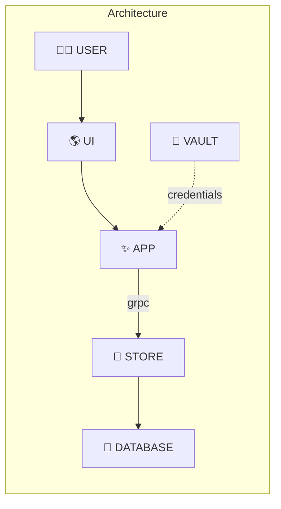

TAMMY
====

```mermaid
graph LR

subgraph Architecture
  user["🧑‍🎓 USER"] 
    --> ui["🌎 UI"] 
    --> app["✨ APP"] 
    -- grpc --> store["🏪 STORE"] 
    --> database["📁 DATABASE"]

	vault["🔐 VAULT"] -. "credentials" .-> app
end
```

- `🔐 VAULT`: We can manage who can access store.
- `🏪 STORE` provides grpc interface, same ORM for all languages
- Scale up `✨ APP` -> Don't add direct pressure to database.
