TAMMY
====

```mermaid
graph LR

vault["🔐 VAULT"]
ui["🌎 UI"]
app["✨ APP"] 
store["🏪 STORE"] 
db["📁 DATABASE"]
etcd["🔊 ETCD"]

subgraph Architecture
  user["🧑‍🎓 USER"] 
    --> ui
    --> app
    -- "grpc" --> store
    --> db

	vault -. "credentials" .-> app
  vault -. "credentials" .-> store
  etcd -. "changes" .-> app
  etcd -. "changes" .-> store
end
```

- `🔐 VAULT` allow us to manage WHEN a certain WHO access WHAT:
	- Who can access store.
	- Who can access database.
- `🏪 STORE` provides grpc interface, same ORM for all languages
	- Scale up `✨ APP` -> Don't add direct pressure to database.
- `🔊 ETCD` notify new nodes come in/out.
	- System can run faster without extra layer (proxy/load balancer).
