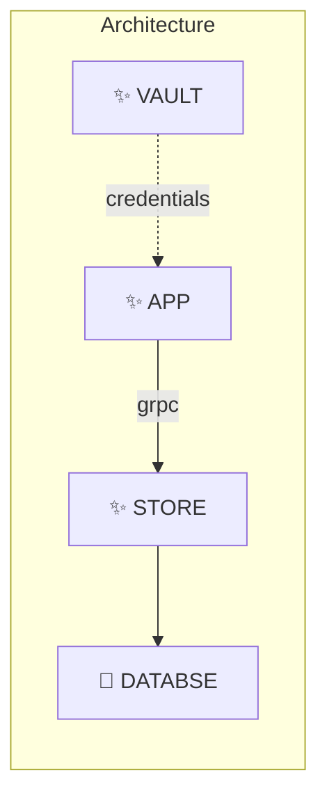

TAMMY
====

```mermaid
graph LR

subgraph Architecture
	vault["✨ VAULT"] -. "credentials" .-> app["✨ APP"]
	app -- grpc --> store["✨ STORE"]
	store --> database["📁 DATABSE"]
end
```

- `✨ VAULT`: We can manage who can access store.
- `✨ STORE` provides grpc interface, same ORM for all languages
- Scale up `✨ APP` -> Don't add direct pressure to database.
