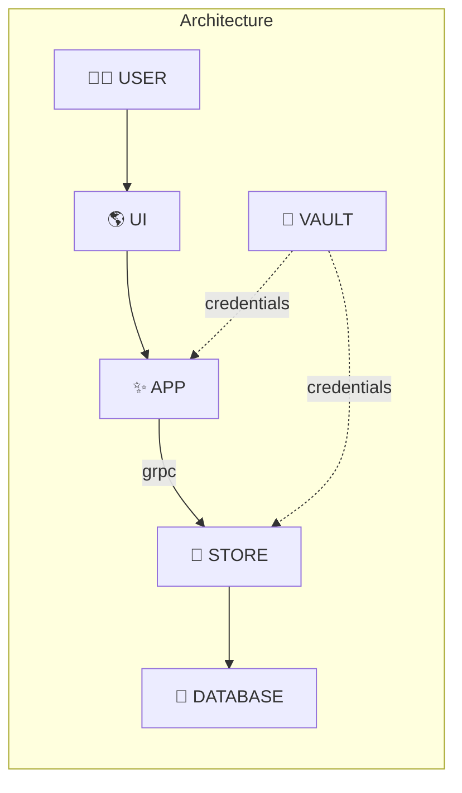

TAMMY
====

```mermaid
graph LR

vault["🔐 VAULT"]
ui["🌎 UI"]
app["✨ APP"] 
store["🏪 STORE"] 
db["📁 DATABASE"]

subgraph Architecture
  user["🧑‍🎓 USER"] 
    --> ui
    --> app
    -- "grpc" --> store
    --> db

	vault -. "credentials" .-> app
  vault -. "credentials" .-> store
end
```

- `🔐 VAULT`: We can manage who can access store.
- `🏪 STORE` provides grpc interface, same ORM for all languages
- Scale up `✨ APP` -> Don't add direct pressure to database.
