TAMMY
====

```mermaid
graph LR

vault["🔐 VAULT"]
ui["🌎 UI"]
app["✨ APP"] 
store["🏪 STORE"] 
db["📁 DATABASE"]
etcd["🔊 ETCD"]

subgraph Architecture
  user["🧑‍🎓 USER"] 
    --> ui
    -- "HTTP/Restful/Websocket" --> app

  subgraph Backend
      app
          -- "grpc" --> store
          --> db

      vault -. "credentials" .-> app
      vault -. "credentials" .-> store
      etcd -..-> app
      etcd -. "changes" .-> store
  end
end
```

1. `🔐 VAULT` allow us to manage WHEN a certain WHO access WHAT:
	1. Who can access store.
	2. Who can access database.
1. `🏪 STORE` provides grpc interface, same ORM for all languages
	1. Scale up `✨ APP` -> Don't add direct pressure to database.
1. `🔊 ETCD`
	1. Notify infrastructure events
		- New node come in/out
			- System can run faster without extra layer (proxy/load balancer).
	1. Provide centralised configuration for applications
		- Simplify configuration for applications -> simpler deployment.
